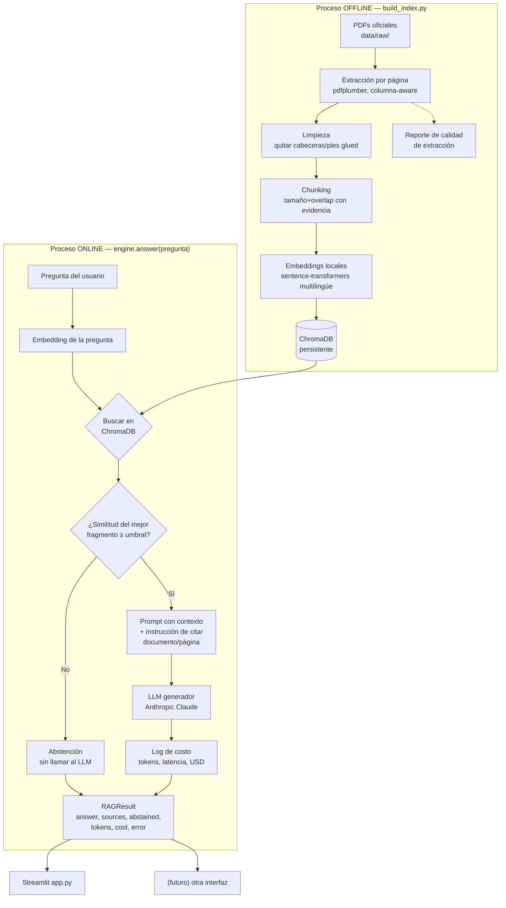
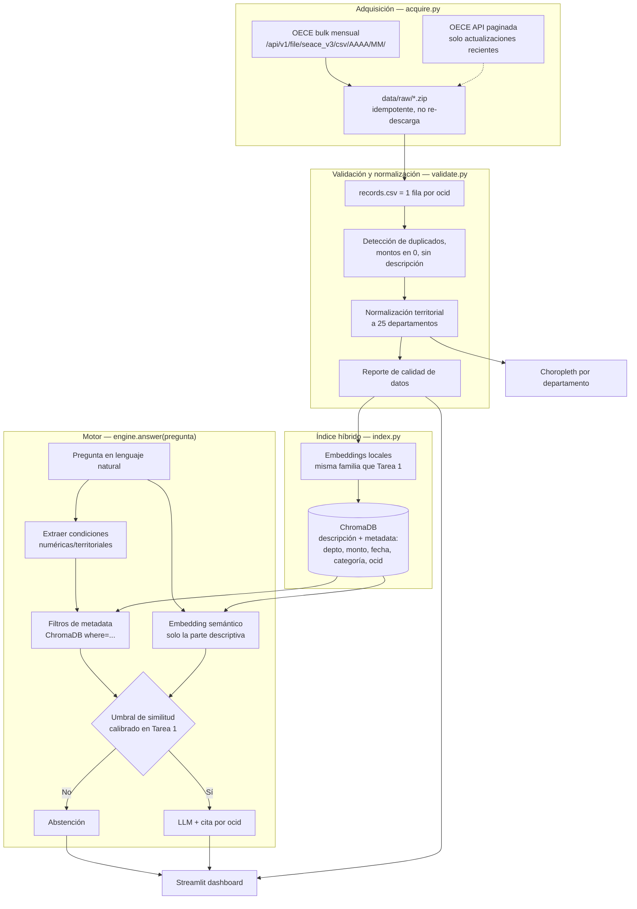

# Diagramas de arquitectura

> Borrador Día 1. Se ajusta a medida que avanzan las fases; estos son los
> diagramas que se muestran en el video antes de cualquier línea de código.

## Tarea 1 — RAG Normativo

Dos procesos separados: uno *offline* (se corre una vez, o cuando cambian los
documentos) y uno *online* (se corre por cada pregunta del usuario). El
proceso online nunca vuelve a leer los PDFs.

Puntos clave que se explican en el video:
- El número de página vive como **metadata** de cada fragmento desde la
  extracción (nunca se pierde al unir/dividir texto), no se infiere del texto.
- La decisión de **no llamar al LLM** ocurre en `B4`, antes de cualquier costo
  de generación — se calibra con el eval set (Fase 4).
- `engine.py` no importa Streamlit ni ninguna librería de interfaz — se
  verifica con `grep -rn "^import\|^from" src/engine.py`.

## Tarea 2 — RAG Radar

Puntos clave:
- El **departamento** vive como metadata estructurada, nunca como texto libre
  para el embedding — así "Cusco" no depende de que el modelo semántico
  entienda geografía.
- Condiciones numéricas y territoriales ("más de un millón", "en Cusco") son
  **filtros** aplicados antes/junto a la búsqueda vectorial, no texto que se
  vectoriza.
- El dashboard **nunca** descarga bulk ni reconstruye el índice al cargar;
  lee artefactos precomputados (`data/processed/`, `chroma_db/`).

## Documentos indexados en la Tarea 1 (decisión de diseño, Día 1)

| # | Documento | Rol | Fuente oficial |
|---|---|---|---|
| 1 | Ley N.° 32069 (versión consolidada, con modificatorias al 19-07-2026) | Norma base | gob.pe / OSCE (fuente base: SPIJ) |
| 2 | Decreto Supremo N.° 001-2026-EF | Modifica el **Reglamento** de la Ley 32069 (el Reglamento en sí no está indexado — límite explícito del corpus) | busquedas.elperuano.pe |
| 3 (opcional) | Decreto Legislativo N.° 1715 | Modifica el literal e) del numeral 85.1 del artículo 85 de la Ley 32069 | busquedas.elperuano.pe |

Por qué esta combinación: el documento 2 obliga al sistema a reconocer los
**límites de su corpus** (preguntas de Reglamento deben verse abstenidas, no
inventadas). El documento 3 (opcional) da un caso concreto y corto (2
páginas) de **atribución de versión**: el texto consolidado del documento 1
ya incorpora el cambio, pero el asistente debe poder citar qué norma
específica lo introdujo cuando se le pregunta.
